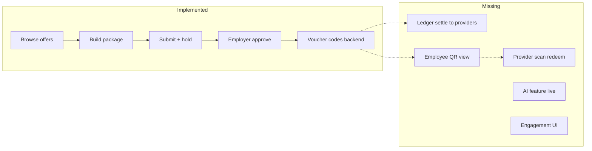
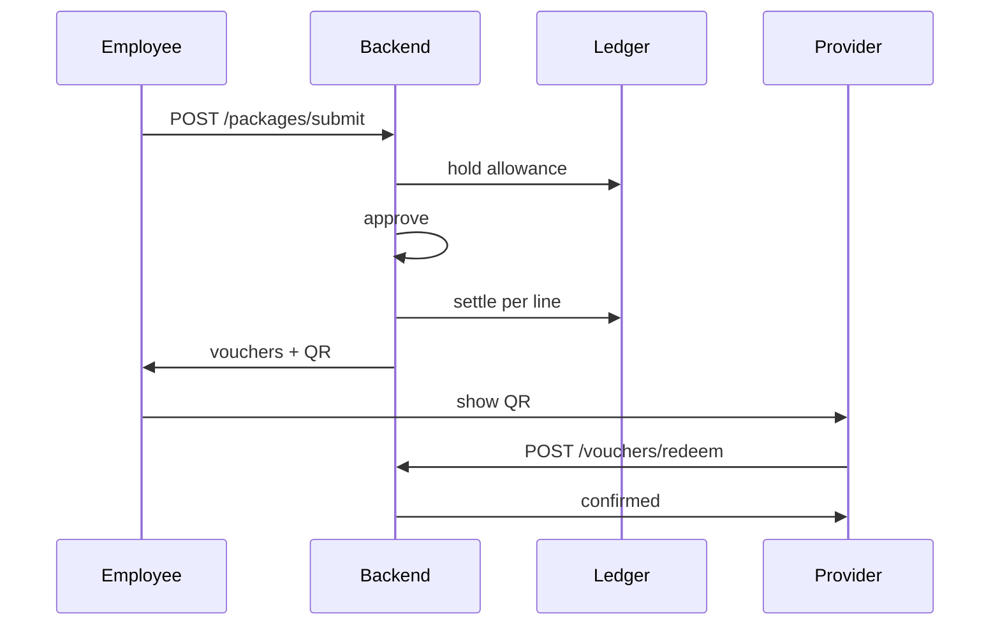

# Perx Feature Audit & Phased Build Plan

## Current State Summary

**Project:** [Perx](F:/teamsystems) — employee benefits marketplace (Express + MongoDB backend, Next.js 16 frontend). Albania-first seed data, globally architected data model.

**What actually works today:** An employee can browse offers, build a multi-provider package, and submit it. The backend holds allowance, auto-approves under threshold, and issues voucher codes. An employer can fund a wallet (stub), edit policy, approve/reject packages, and view basic insights. Providers can CRUD offers.

**Critical gap:** The core loop stops at `approved` — no ledger settlement to providers, no employee QR screen, no provider redemption. This fails the hackathon minimum demo and the 20% "implementation" rubric in [context.md](F:/teamsystems/backend/context.md).

---

## Feature Tally: Implemented vs Remaining

### I. Platform Core & Financial Engine

| Feature                                                       | Status          | Evidence                                                                                                                                                                                       |
| ------------------------------------------------------------- | --------------- | ---------------------------------------------------------------------------------------------------------------------------------------------------------------------------------------------- |
| Wallet-based ledger (category buckets)                        | **Not built**   | Single flat `EmployeeAllowance` in [EmployeeAllowance.ts](F:/teamsystems/backend/src/models/EmployeeAllowance.ts). No Food/Wellness/Travel/**Bonus** wallets. `Bonus` category does not exist. |
| Clearinghouse model (pre-fund, float, provider invoicing)     | **Not built**   | `walletBalance` is a direct counter in [employer.routes.ts](F:/teamsystems/backend/src/routes/employer.routes.ts) (`// TEMP`). No platform float, no provider invoicing.                       |
| Deal visibility engine (`visibility_array`, Public/Exclusive) | **Not built**   | [Offer.ts](F:/teamsystems/backend/src/models/Offer.ts) has no company-scoping. All offers visible globally (filtered only by `allowedCategories`).                                             |
| Expiration: UIOL vs Rollover                                  | **Not built**   | `periodResetAt` + `resetPeriod` metadata only. No reset job, no rollover policy field on [EmployerPolicy.ts](F:/teamsystems/backend/src/models/EmployerPolicy.ts).                             |
| Albanian Tax Engine (Law 29/2023)                             | **Not built**   | Zero tax classification, payroll export, or fringe-benefit tagging anywhere.                                                                                                                   |
| **Partial:** Offer categories as taxonomy                     | **Done**        | `wellness`, `food`, `travel`, `learning`, `lifestyle` — used for filtering, not wallets.                                                                                                       |
| **Partial:** Wallet + Ledger schemas                          | **Schema only** | [Wallet.ts](F:/teamsystems/backend/src/models/Wallet.ts), [LedgerEntry.ts](F:/teamsystems/backend/src/models/LedgerEntry.ts) — never written at runtime.                                       |
| **Partial:** Allowance hold/consume                           | **Done**        | [package.service.ts](F:/teamsystems/backend/src/services/package.service.ts) — hold on submit, release on reject, consume on approve.                                                          |
| **Partial:** Employer pre-funding                             | **Stub**        | `POST /employer/wallet/fund` increments balance directly.                                                                                                                                      |

### II. Employee App (Mobile-First Web)

| Feature                                               | Status        | Evidence                                                                                                                                                                                                                                           |
| ----------------------------------------------------- | ------------- | -------------------------------------------------------------------------------------------------------------------------------------------------------------------------------------------------------------------------------------------------- |
| Categorized wallet header                             | **Not built** | [budget-meter.tsx](F:/teamsystems/frontend/components/perx/budget-meter.tsx) shows flat total only.                                                                                                                                                |
| 1-click zero-cash checkout + QR                       | **Partial**   | Multi-step cart in [package-builder-sheet.tsx](F:/teamsystems/frontend/components/perx/package-builder-sheet.tsx). QR component exists ([package-stub.tsx](F:/teamsystems/frontend/components/perx/package-stub.tsx)) but never shown post-submit. |
| Algorithmic deals feed + urgency tags                 | **Not built** | Chronological sort only. `Drop` model + `GET /offers/drops` exist but [useDrops()](F:/teamsystems/frontend/lib/hooks/use-offers.ts) is unused.                                                                                                     |
| P2P micro-gifting                                     | **Not built** | [Gift.ts](F:/teamsystems/backend/src/models/Gift.ts) model only. No routes or UI.                                                                                                                                                                  |
| Zero-budget tiers (discount codes)                    | **Not built** | Over-budget blocked entirely.                                                                                                                                                                                                                      |
| Gamification (streaks, XP, bonus wallet, team quests) | **Not built** | No models, routes, or UI.                                                                                                                                                                                                                          |
| AI: Bora concierge                                    | **Not built** | Contract in [api.ts](F:/teamsystems/backend/contracts/api.ts) only. No route, no Anthropic integration.                                                                                                                                            |
| AI: Dynamic bundling                                  | **Not built** | Same — contracts only.                                                                                                                                                                                                                             |
| **Done:** Marketplace browse + category filter        | **Done**      | [marketplace/page.tsx](F:/teamsystems/frontend/app/(employee)/marketplace/page.tsx)                                                                                                                                                                |
| **Done:** Package builder + submit                    | **Done**      | Zustand store + API hooks                                                                                                                                                                                                                          |
| **Done:** Auth + employee signup                      | **Done**      | [signup/employee](F:/teamsystems/frontend/app/(auth)/signup/employee/page.tsx)                                                                                                                                                                     |

### III. Employer Dashboard

| Feature                              | Status        | Evidence                                                                                                                                              |
| ------------------------------------ | ------------- | ----------------------------------------------------------------------------------------------------------------------------------------------------- |
| CSV onboarding & category budgets    | **Not built** | Employees join one-by-one via signup. Single `perEmployeeAllowance`, not per-category.                                                                |
| Automated invoicing (Fiskalizimi)    | **Not built** | No invoice model or fiscalization.                                                                                                                    |
| Payroll export (taxable vs exempt)   | **Not built** | Depends on tax engine.                                                                                                                                |
| Market benchmarking                  | **Not built** | No cross-company analytics.                                                                                                                           |
| AI: Tax-Maximizer                    | **Not built** |                                                                                                                                                       |
| AI: Actionable Pulse                 | **Not built** |                                                                                                                                                       |
| AI: Budget Salvage Alerts            | **Not built** |                                                                                                                                                       |
| **Done:** Overview (wallet + policy) | **Done**      | [employer/page.tsx](F:/teamsystems/frontend/app/(employer)/employer/page.tsx)                                                                         |
| **Done:** Approvals queue            | **Done**      | [employer/approvals](F:/teamsystems/frontend/app/(employer)/employer/approvals/page.tsx)                                                              |
| **Done:** Employee roster            | **Done**      | [employer/employees](F:/teamsystems/frontend/app/(employer)/employer/employees/page.tsx)                                                              |
| **Partial:** Insights                | **Partial**   | Utilization + spend-by-category in [employer/insights](F:/teamsystems/frontend/app/(employer)/employer/insights/page.tsx). `suggestions` always `[]`. |

### IV. Provider Portal

| Feature                                         | Status        | Evidence                                                                         |
| ----------------------------------------------- | ------------- | -------------------------------------------------------------------------------- |
| QR scanner for redemption                       | **Not built** | No `POST /vouchers/:code/redeem` in [app.ts](F:/teamsystems/backend/src/app.ts). |
| Yield management (caps, time windows, velocity) | **Not built** | Only `expiresAt` + `isLimited` on offers.                                        |
| Automated earnings reconciliation               | **Not built** | No provider wallet credits or invoice generation.                                |
| AI: Gap Analyzer / Off-Peak Optimizer           | **Not built** |                                                                                  |
| **Done:** Offer CRUD                            | **Done**      | [provider/page.tsx](F:/teamsystems/frontend/app/(provider)/provider/page.tsx)    |

### Cross-Cutting (Hackathon Brief)

| Requirement                                          | Status                                                                                |
| ---------------------------------------------------- | ------------------------------------------------------------------------------------- |
| Core loop: browse → approve → pay provider → confirm | **~60%** — missing settlement + redeem                                                |
| Multi-provider packages                              | **Done**                                                                              |
| Simulated payments                                   | **Partial** — allowance only, no provider payout                                      |
| Albania focus (ALL, Tirana providers)                | **Done** — [seed.ts](F:/teamsystems/backend/src/scripts/seed.ts)                      |
| Multi-language / multi-currency architecture         | **Partial** — `locale`/`currency` fields; UI is English-only, `formatALL()` hardcoded |
| At least one AI or engagement feature live           | **Not demo-ready** — drops API exists but not shown                                   |
| Seed demo accounts                                   | **Done** — `elira@acme.test` / `demo123` etc.                                         |

**Rough completion vs your full spec: ~25–30% implemented, ~40% scaffolded (models/contracts), ~35–40% not started.**

---

## Recommended Phases (Real Software Project Order)

Principle from [context.md](F:/teamsystems/backend/context.md): **"A bulletproof core loop with two strong features beats a wobbly app with ten features."** Each phase is a shippable increment.

---

### Phase 0 — Baseline (DONE)

What you have now. No work needed except bug fixes (e.g. package builder still uses hardcoded [employee fixture](F:/teamsystems/frontend/lib/fixtures/employee.ts) for over-budget preview while marketplace uses live API).

**Exit criteria:** Auth, catalog, package submit, employer approve, voucher codes generated server-side.

---

### Phase 1 — Hackathon Demo Loop (P0, ~2–3 days)

**Goal:** Satisfy the problem statement minimum: employee selects package → employer approves → simulated payment to provider(s) → benefit confirmed + one live AI/engagement feature.

**Backend:**

1. `**ledger.service.ts`** — implement `fund`, `hold`, `settle`, `refund` per [context.md §5](F:/teamsystems/backend/context.md). Every money change writes `LedgerEntry`.
2. **Wire settlement in `approvePackage()`** — debit company wallet, credit each provider wallet (one `settle` per `PackageLine`), set package status `settled`.
3. `**POST /vouchers/:code/redeem**` — provider scans code, marks voucher redeemed, optional XP hook stub for Phase 7.
4. `**GET /me/packages**` + include vouchers in response for approved/settled packages.
5. **Seed golden demo state** — one package stuck in `pending` for employer approval demo; one auto-approved with vouchers ready.

**Frontend:**

1. **Voucher/QR screen** — after submit (or from package history), render [package-stub.tsx](F:/teamsystems/frontend/components/perx/package-stub.tsx) with real codes from API.
2. **Provider scanner page** — camera QR scan (or manual code entry fallback) at `/provider/scan`.
3. **The Drop band** — wire `useDrops()` on marketplace; countdown + `badgeLabel` per [design.md](F:/teamsystems/frontend/design.md).
4. **Fix allowance consistency** — package builder uses `useAllowance()` not fixture.

**AI (pick one for demo, build both if time):**

1. `**POST /ai/concierge`** + `**POST /ai/bundle**` — shared service, Anthropic with **cached fallback** (required for stage).
2. **Concierge UI** — chat sheet on marketplace; materializes `Package(source=ai)`.

**Exit criteria:** 90-second stage demo: Elira browses → builds 2-provider package → auto-approve OR manager approves → QR appears → provider scans → "redeemed". Drop banner visible. Concierge returns a bundle.

---

### Phase 2 — Engagement Layer (P1, ~2 days)

**Goal:** "Would I reopen this next week?" — per [context.md §9](F:/teamsystems/backend/context.md).

1. **Notifications** — `GET /me/notifications`, bell icon, mark read. Wire on approve/reject/gift/nudge.
2. **Gifting** — `POST /gifts`, colleague picker, allowance transfer via ledger.
3. **Budget-burn nudges** — cron/endpoint: employees with >50% unused allowance within 7 days of `periodResetAt` get notification + 3 offer suggestions.
4. **Perx Wrapped** — `GET /me/wrapped` aggregates from ledger; shareable card UI.
5. **Package history page** — `/marketplace/history` or tab in employee nav.

**Exit criteria:** Gift sends notification; nudge fires for seeded near-expiry employee; Wrapped shows stats.

---

### Phase 3 — Employer Ops Polish (P1, ~1–2 days)

**Goal:** Make the employer side demo-worthy beyond approvals.

1. **CSV roster import** — `POST /employer/employees/import` parses CSV, creates users + allowances.
2. **Real insights** — populate `suggestions` in employer.routes.ts from `SelectionEvent` + unused allowance data.
3. **Provider earnings view** — `GET /provider/earnings` from provider wallet balance + pending settlements.
4. **Period reset job** — monthly cron: reset `EmployeeAllowance.total` per `resetPeriod` (UIOL only for now).

**Exit criteria:** Employer uploads 10 employees via CSV; insights show actionable suggestion; provider sees earnings balance.

---

### Phase 4 — Categorized Wallets (P2, ~2–3 days)

**Goal:** Your spec's wallet buckets — this is a **schema migration**, not a UI tweak.

1. **New model: `CategoryWallet`** — `{ userId, companyId, category, total, used, held }` replacing single allowance (or nested under allowance).
2. **Employer policy** — `categoryBudgets: { food: 5000, wellness: 3000, ... }` instead of flat `perEmployeeAllowance`.
3. **Hold/settle** — validate and debit the correct category per offer line.
4. **Categorized wallet header UI** — segmented bar showing per-bucket balances.
5. **Add `bonus` category** to taxonomy.

**Exit criteria:** Employee sees 3+ category balances; submitting a food offer only debits food wallet.

---

### Phase 5 — Deal Engine & Feed Intelligence (P2, ~2 days)

1. `**visibility_array` on Offer** — `public` or `exclusive: [companyId]`. Filter in [offers.routes.ts](F:/teamsystems/backend/src/routes/offers.routes.ts).
2. **Urgency tags** — surface `isLimited`, `expiresAt`, inventory remaining on `OfferCard`.
3. **Ranked feed** — score = proximity to allowance expiry + drop boost + category affinity (from `SelectionEvent`).
4. **Zero-budget tiers** — when total available = 0, switch feed to `offer.type = 'discount_code'` offers (new field); employee pays out of pocket (simulated).

**Exit criteria:** Exclusive deal visible only to Acme employees; feed shows "Only 3 left" badges.

---

### Phase 6 — Albanian Tax & Compliance (P2, ~2 days)

**Goal:** Differentiator for Albania market; enables employer payroll export.

1. `**taxClass` on Offer/Category** — `exempt` (food, travel) vs `taxable_fringe` (gym, entertainment) per Law 29/2023.
2. **Tag `LedgerEntry.meta.taxClass`** on every settle.
3. `**GET /employer/payroll-export?month=**` — CSV: employee, category, amount, taxClass.
4. **Tax-Maximizer alert** — if >30% discretionary (wellness) unused mid-month, suggest reallocation to food (exempt). Rule-based first; LLM summary optional.

**Exit criteria:** Payroll CSV downloads with correct tax tags; employer dashboard shows one Tax-Maximizer alert.

---

### Phase 7 — Gamification (P3, stretch)

Only after loop + engagement are solid.

1. `**UserProgress`** model — XP, level, streak count.
2. **XP on voucher redeem** (verified streak — scan required).
3. **Employer bonus pool** — separate `bonus` category wallet funded by employer; unlock at level milestones.
4. **Team quests** — `Quest` model with company-wide aggregate (e.g. 50 wellness redemptions); progress bar on marketplace.

**Exit criteria:** Redeeming a voucher increments XP; level 5 unlocks bonus wallet credit.

---

### Phase 8 — Provider Advanced + AI (P3, stretch)

1. **Yield management** — `maxRedemptions`, `validHours`, `velocityLimit` on Offer; enforce in submit + redeem.
2. **Monthly provider invoice** — `GET /provider/invoice?month=` PDF/CSV from ledger.
3. **Gap Analyzer** — query expiring allowances within radius (use seeded geo or city filter); suggest flash deal template.
4. **Off-Peak Optimizer** — analyze redemption timestamps; suggest time-window discounts.

---

### Phase 9 — Enterprise & International (P4, post-hackathon)

1. **Fiskalizimi** — simulated B2B invoice generation (no real fiscal API needed for demo).
2. **Market benchmarking** — anonymized cross-tenant aggregates.
3. **Actionable Pulse** — team-level spend deltas without PII.
4. **i18n** — `next-intl`, sq + en; locale-aware AI responses.
5. **Multi-currency** — generic `formatMoney(amount, currency)` replacing `formatALL()`.

---

## What to Cut for Hackathon (if time-constrained)

If you have <48 hours total remaining, **do Phase 1 only** plus Drop UI. Defer:

- Categorized wallets (Phase 4) — flat allowance is acceptable for demo
- Tax engine (Phase 6) — mention in pitch as Phase 2 product
- Gamification (Phase 7) — describe in deck, show mockups
- Provider yield management (Phase 8) — basic redeem is enough
- Fiskalizimi, benchmarking, CSV import — post-hackathon

**Minimum viable pitch stack:** Core loop + Drops + Concierge + employer approvals + one multi-provider package in seed.

---

## Suggested Team Parallelization

| Track         | Owner        | Phase 1 focus                                    |
| ------------- | ------------ | ------------------------------------------------ |
| Backend money | Backend dev  | `ledger.service.ts`, settlement, redeem endpoint |
| Backend AI    | Backend dev  | Concierge service + fallback cache               |
| Employee UI   | Frontend dev | QR/voucher screen, Drop band, Concierge chat     |
| Provider UI   | Frontend dev | Scanner page                                     |
| Employer UI   | Frontend dev | Polish approvals flow, show settlement status    |
| Demo/seed     | Either       | Golden demo state, stage script                  |

---

## Key Files to Touch in Phase 1

- [package.service.ts](F:/teamsystems/backend/src/services/package.service.ts) — settlement + status `settled`
- New: `backend/src/services/ledger.service.ts`
- [app.ts](F:/teamsystems/backend/src/app.ts) — register voucher + AI routes
- [package-builder-sheet.tsx](F:/teamsystems/frontend/components/perx/package-builder-sheet.tsx) — post-submit voucher flow
- New: `frontend/app/(provider)/provider/scan/page.tsx`
- [marketplace/page.tsx](F:/teamsystems/frontend/app/(employee)/marketplace/page.tsx) — Drop band + Concierge entry
- [seed.ts](F:/teamsystems/backend/src/scripts/seed.ts) — demo state

