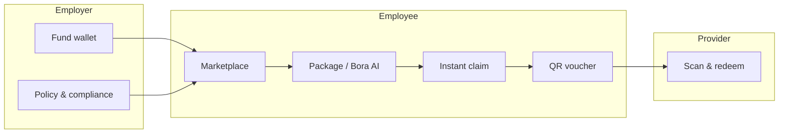
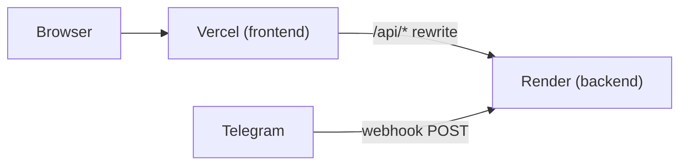

# Perx

**The employee benefits marketplace that feels like a consumer app — not a once-a-quarter HR portal.**

Perx lets employees discover perks, build multi-provider packages, and claim them instantly from their allowance. Employers fund a company wallet and set policy. Providers list offers and redeem vouchers at the point of sale. Money flows employer → provider; employees never handle cash.

Built for **JunctionX Tirana 2026** (TeamSystem challenge). Albania-first seed data (Tirana providers, ALL pricing), globally architected (currency and locale are configuration, not hardcoded assumptions).

---

## Why Perx exists

Most benefits platforms are opened once when HR sends an email, then forgotten. Perx is designed to be reopened weekly: drops, AI discovery, gifting, streaks, Wrapped summaries, and a Telegram bot that meets employees where they already chat.

The core promise is simple:

> Browse → build a package → claim → show QR → provider scans → done.

No expense reports. No reimbursement waits. If you have allowance and the perk passes compliance, you get your voucher immediately.



---

## Three portals, one platform

| Portal | Who uses it | What they do |
|--------|-------------|--------------|
| **Employee** | Staff at enrolled companies | Browse perks, claim packages, track history, gift colleagues, earn XP |
| **Employer** | HR / benefits admins | Fund wallet, set allowance policy, review compliance flags and off-catalog requests |
| **Provider** | Gyms, cafés, cinemas, etc. | Manage offers, scan vouchers, view earnings |

Users can hold multiple roles (e.g. employer admin who is also an employee). Login routes to the right home screen automatically.

---

## Feature highlights

### For employees

- **Marketplace** — Category browse (wellness, food, travel, learning, lifestyle), personalized feed, limited-time drops, and provider showcases.
- **Package builder** — Add offers from multiple providers into one cart; claim in one tap.
- **Instant claims** — Packages auto-settle when you have enough allowance. No waiting on manager approval.
- **Bora AI concierge** — Chat to discover perks, get bundles for a goal + budget, or request perks not yet in the catalog.
- **POS bundler** — Smart upsells when you pick certain offers (e.g. cinema ticket + ride + snacks).
- **Vouchers & history** — QR codes for every line item; full claim history on the web app.
- **Perx Wrapped** — A Spotify-style summary of how you used your benefits this period.
- **P2P gifting** — Send allowance credit to a colleague with a note.
- **Gamification** — XP and levels on redemption, streaks, team quests, bonus wallet unlock.
- **Team pooled carts** — Split an expensive perk with coworkers via an invite link.
- **Peer advocacy** — Nudge colleagues to try a perk you loved after you redeem.
- **Telegram bot** — Link your account, check balances, get recommendations, and purchase perks — QR delivered in chat.
- **Notifications** — Gifts, nudges, XP milestones, compliance updates, and more.

### For employers

- **Company overview** — Wallet balance, policy snapshot, fund wallet in one place.
- **Policy editor** — Per-employee allowance, allowed categories, reset period, currency.
- **Employee roster** — See who is on the plan and how much allowance they have used.
- **Compliance queue** — Review flagged claims (e.g. competitor conflicts in regulated sectors).
- **Benefit requests** — Approve or reject off-catalog requests forwarded from Bora.
- **Insights** — Utilization, unused categories, and actionable suggestions.

### For providers

- **Offer CRUD** — Create, edit, and retire marketplace listings.
- **Scan to redeem** — Enter or scan voucher codes; confirm benefit delivery.
- **Earnings dashboard** — Track revenue from redemptions.

---

## Tech stack

| Layer | Technology |
|-------|------------|
| Frontend | Next.js 16, React 19, TypeScript, Tailwind CSS, Zustand |
| Backend | Express 5, TypeScript, Zod validation |
| Database | MongoDB (Mongoose) |
| AI | Groq API (concierge, bundling, compliance assist) |
| Bot | Telegram Bot API (optional, via `TELEGRAM_BOT_TOKEN`) |

Monorepo layout:

```
teamsystems/
├── backend/          # API, business logic, ledger, bot
├── frontend/         # Next.js web app (employee, employer, provider)
└── README.md         # You are here
```

---

## Quick start

### Prerequisites

- **Node.js** 20+
- **MongoDB** — local instance or Atlas cluster
- *(Optional)* Groq API key for live AI
- *(Optional)* Telegram bot token for the chat integration

### 1. Clone and install

```bash
git clone <your-repo-url>
cd teamsystems

cd backend && npm install
cd ../frontend && npm install
```

### 2. Configure environment

**Backend** (`backend/.env`):

```bash
cd backend
cp .env.example .env
```

| Variable | Required | Description |
|----------|----------|-------------|
| `MONGODB_URI` | Yes | MongoDB connection string |
| `SESSION_SECRET` | Yes | Secret for auth tokens |
| `PORT` | No | API port (default `4000`) |
| `APP_URL` | Prod | Your Vercel frontend URL (CORS) |
| `GROQ_API_KEY` | No | Live AI; cached fallback without it |
| `TELEGRAM_BOT_TOKEN` | No | Enables Telegram (webhook on Render) |

**Frontend** (`frontend/.env.local` — optional for local dev):

```bash
cd frontend
cp .env.example .env.local
```

`BACKEND_URL=http://localhost:4000` proxies browser calls from `/api/*` to the backend (see `next.config.ts`).

### 3. Seed the demo database

```bash
cd backend
npm run seed
```

This wipes and repopulates a rich demo dataset (companies, offers, claim history, compliance scenarios, pooled carts, gifts, and more). All demo passwords: **`demo123`**.

For the fullest showcase data:

```bash
npm run seed:demo
```

### 4. Run locally

**Terminal 1 — API:**

```bash
cd backend
npm run dev
```

**Terminal 2 — Web app:**

```bash
cd frontend
npm run dev
```

Open **[http://localhost:3000](http://localhost:3000)**. The browser calls **`/api/*`**, which Next.js proxies to the backend on port 4000.

---

## Deploy (Vercel + Render)

Architecture: **Vercel** serves the Next.js app; **Render** runs the Express API and Telegram webhook. The browser only talks to `/api` on your Vercel domain — no CORS configuration needed in the app.



### 1. Deploy backend on Render

1. Push this repo to GitHub.
2. In [Render](https://render.com), **New → Blueprint** and select `render.yaml`,  
   **or** create a **Web Service** manually:
   - **Root directory:** `backend`
   - **Build:** `npm install --include=dev && npm run build`
   - **Start:** `npm start`
   - **Health check path:** `/healthz`
3. Set environment variables:

| Key | Value |
|-----|--------|
| `NODE_ENV` | `production` |
| `MONGODB_URI` | Your Atlas connection string |
| `SESSION_SECRET` | Long random string |
| `APP_URL` | `https://your-app.vercel.app` |
| `TELEGRAM_BOT_TOKEN` | From [@BotFather](https://t.me/BotFather) |
| `GROQ_API_KEY` | *(optional)* |

`RENDER_EXTERNAL_URL` is set automatically. The API uses it to register the Telegram **webhook** at `https://your-service.onrender.com/telegram/webhook` (more reliable than polling on a PaaS).

4. After deploy, seed production once from your machine:

```bash
cd backend
MONGODB_URI="your-atlas-uri" npm run seed:demo
```

### 2. Deploy frontend on Vercel

1. Import the repo in [Vercel](https://vercel.com).
2. Set **Root Directory** to `frontend`.
3. Add environment variable:

| Key | Value |
|-----|--------|
| `BACKEND_URL` | `https://your-service.onrender.com` (no trailing slash) |

4. Deploy. `vercel.json` and `next.config.ts` route `/api/:path*` → your Render backend.

5. Update Render `APP_URL` to your final Vercel URL and redeploy if needed.

### API unification

| Environment | Browser calls | Proxied to |
|-------------|---------------|------------|
| Local dev | `/api/auth/login` | `http://localhost:4000/auth/login` |
| Production | `/api/auth/login` | `https://perx-api.onrender.com/auth/login` |

Override with `NEXT_PUBLIC_API_URL` only if you need to hit the backend directly (not recommended in production).

### Telegram in production

- **Webhook mode** (default on Render): Telegram pushes messages to your API; works even when the free tier sleeps (incoming webhook wakes the service).
- **Polling mode** (local dev): long-polling when `NODE_ENV !== production` or `TELEGRAM_USE_POLLING=true`.
- Verify: message your bot after deploy; check Render logs for `[telegram] webhook mode`.

---

## Try the demo

After seeding, log in with any account below. Password for all: **`demo123`**

| Email | Role | What to explore |
|-------|------|-----------------|
| `elira@acme.test` | Employee | Marketplace, Bora, history, Wrapped, Telegram link |
| `nora@acme.test` | Employee | Budget nudges, pooled cart contributor |
| `ardit@acme.test` | Employee | Pooled cart host — invite code **DEMO24** |
| `mira@acme.test` | Employee | Pending benefit request |
| `luan@acme.test` | Employee | Compliance-blocked telecom perk |
| `dritan@acme.test` | Employer + employee | Compliance queue, insights, employees |
| `provider@perx.test` | Provider | Espa Tirana — scan vouchers, earnings |
| `mulliri@perx.test` | Employer + provider | Dual-role admin |

**Suggested walkthrough**

1. Log in as **elira@** → browse marketplace → add offers → **Claim package** → open History for QR codes.
2. Log in as **provider@** → Scan → redeem a code from elira’s history.
3. Log in as **dritan@** → Compliance + Benefit requests.
4. Visit **`/marketplace/pool/DEMO24`** as ardit@ or nora@ for team pooling.
5. On Progress, generate a Telegram link code and message the bot (if `TELEGRAM_BOT_TOKEN` is configured).

---

## How money works

Perx uses a **wallet + ledger** model:

1. **Employer** pre-funds a company wallet.
2. **Employee** claims a package → allowance is held, then consumed on settlement.
3. **Ledger entries** record the flow to provider wallets.
4. **Vouchers** are issued per package line; providers redeem them to confirm delivery.

Employees see allowance as **total / used / held / available**. Bonus wallet credits unlock through gamification (level 5+).

Compliance checks can block or flag specific offers before a claim completes (e.g. employer–provider conflict in telecom).

---

## API overview

REST API on port `4000`. Auth via `Authorization: Bearer <token>` after `POST /auth/login`.

| Area | Examples |
|------|----------|
| Auth | `/auth/login`, `/auth/signup/employee`, `/auth/signup/company` |
| Offers | `/offers`, `/offers/drops`, `/offers/pos-bundle` |
| Packages | `POST /packages`, `POST /packages/:id/submit` |
| Employee | `/me/allowance`, `/me/packages`, `/me/wrapped`, `/me/progress` |
| AI | `/ai/concierge`, `/ai/bundle` |
| Employer | `/employer/company`, `/employer/policy`, `/employer/compliance` |
| Provider | `/provider/offers`, `POST /vouchers/:code/redeem` |
| Social | `/gifts`, `/pooled-carts`, `/me/activity/feed` |

Shared TypeScript contracts live in `backend/contracts/api.ts` and `frontend/lib/api/contracts.ts`.

---

## Scripts

**Backend** (`backend/`)

| Command | Description |
|---------|-------------|
| `npm run dev` | Start API with hot reload |
| `npm run seed` | Reset DB and seed demo data |
| `npm run seed:demo` | Seed with full showcase extras |
| `npm run typecheck` | TypeScript check |
| `npm run build` | Compile to `dist/` |

**Frontend** (`frontend/`)

| Command | Description |
|---------|-------------|
| `npm run dev` | Start Next.js dev server |
| `npm run build` | Production build |
| `npm run start` | Serve production build |

---

## Environment variables (frontend)

| Variable | When | Description |
|----------|------|-------------|
| `BACKEND_URL` | Vercel build | Render API URL for `/api` proxy (required in production) |
| `NEXT_PUBLIC_API_URL` | Optional | Skip proxy; call backend URL directly from browser |

---

## What’s next

Roadmap items not yet in the product include CSV employee import, Albanian tax/payroll export, full categorized wallet UI in the web app, automated period reset jobs, and provider invoicing at platform scale. The core claim → voucher → redeem loop is complete and demo-ready.

---

## License

Private / hackathon project. Update this section if you open-source the repo.

---

<p align="center">
  <strong>Perx</strong> — benefits people actually want to use.<br>
  Built with care in Tirana.
</p>
